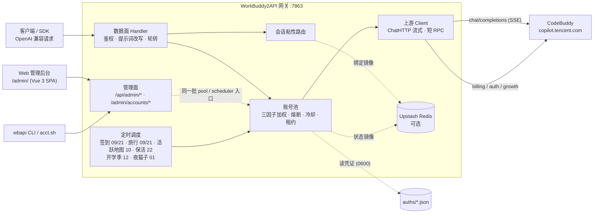

<p align="center">
  
</p>

<h1 align="center">WorkBuddy2API</h1>

<p align="center">
  <b>把 CodeBuddy 账号变成 OpenAI 兼容 API 的多账号网关</b><br>
  OAuth 登录 · 账号池轮转 · 熔断与冷却 · 会话粘性 · 积分补充 · 内置管理面板
</p>

<p align="center">
  
  
  
  
  <a href="https://t.me/sliverkiss_blog"></a>
</p>

---

> **本仓库是 [Sliverkiss/workbuddy2api](https://github.com/Sliverkiss/workbuddy2api) 的 fork**，由 [@YuleBest](https://github.com/YuleBest) 维护。
> 上游的账号池、调度、改写管线等核心能力原样保留，另加了**内置 Web 管理后台**、**多 key 存储**、
> **`wbapi` 运维 CLI** 与 **Windows 计划任务部署**，完整清单见[本分支相对上游的改动](#本分支相对上游的改动)。
> 与上游兼容：配置键、HTTP 端点、脚本入口都是增量的，可直接替换上游二进制。

## 项目简介

WorkBuddy2API 是一个自托管的 **OpenAI 兼容上游网关**，将 ```CodeBuddy``` 账号包装为统一的 `/v1/chat/completions` 服务。

### 本项目做什么

- 通过 **OAuth 设备授权**（`login.sh`）获取账号凭证，在网关侧做 token 自动刷新、账号池调度与流量治理；
- 面向 **个人多账号** 场景：多账号共享、单号故障自动换号、冷却 / 熔断防止雪崩、会话粘性保证多轮上下文不跳号；
- 对客户端只暴露 OpenAI 兼容接口，现有 SDK / 前端 / 工具 **零改造接入**。

### 本项目不做什么

- **只做上游网关，不做下游协议转换** — 本项目仅负责对接上游 ```CodeBuddy``` 并暴露 OpenAI Chat 协议；Anthropic Messages、Gemini 等其他协议的适配应由下游网关负责；
- **不做多租户** — 网关是单人 / 小团队的自托管工具，key 只用来区分「谁能调用」，不区分配额、不记账到人。

### 本分支相对上游的改动

| 改动 | 说明 |
|---|---|
| **内置 Web 管理后台** | `internal/admin`（观测 API + 运维动作）+ `web/`（Vue 3 SPA），构建产物经 `go:embed` 打进二进制，不需要单独部署前端或数据库。见 [Web 管理后台](#web-管理后台) |
| **多 key 存储** | `keys.json` 管理多把调用 key，支持热重载与面板 / CLI 增删，不用再改配置重启。见 [调用密钥](#调用密钥多-key) |
| **`wbapi` 运维 CLI** | 一个 Python 3 脚本收口日常运维：状态、自检、账号、配额、密钥、模型、任务、日志、服务启停。见 [运维 CLI](#运维-cliwbapi) |
| **Windows 计划任务部署** | `wbapi start\|stop\|restart\|status\|log\|doctor` 在 Windows 下自动改走 `schtasks` / `taskkill`，配合 `gateway-task.cmd` / `tunnel-task.cmd` 做登录自启 |
| **管理面扩展** | 新增 `GET/POST /api/admin/*`（总览、账号、密钥、日志、模型、配置、任务触发）与账号「清冷却」动作；面板内对话走 `/api/admin/v1/chat/completions`，与真实客户端同链路 |
| **ZCode 请求体归一化** | `internal/upstream/zcode.go` 把 AI-SDK v5 / ZCode 形态的请求（内容块数组、字典形态 tools、`maxOutputTokens`）归一成标准 OpenAI 形态，并把没有配对的孤儿 tool 消息降级为 user，避免上游报错 |
| **登录脚本权限指引** | `login.sh` 按部署模式给建议：systemd 主机提示 chown 给 unit 里的 `User`，只有真容器环境才提示 `10001` |

### 社区前端面板

本仓库**自带内置面板**（见 [Web 管理后台](#web-管理后台)，Vue 3 单页应用，编译进二进制，无需额外部署）。
需要更多第三方形态的话，以下是符合本理念的社区项目（独立维护，与网关解耦）：

- [workbuddy2api-gui](https://github.com/287775856/workbuddy2api-gui) — 账号池状态可视化面板
- [workbuddy-manager](https://github.com/ithtelab/workbuddy-manager) — 账号管理工具

> ⚠️ 合规须知：本项目是**非官方**网关，使用 ```CodeBuddy``` 账号作为上游，**仅限本人授权账号、本机 / 私有环境测试**。详细边界见[安全与合规](#安全与合规)。

📖 上游完整文档见 [GitHub Wiki](https://github.com/Sliverkiss/workbuddy2api/wiki)。

## 核心能力

### 账号池治理

- **OAuth 设备授权登录** — `login.sh` 一条命令完成：取授权 URL → 浏览器登录 → token 轮询 → 凭证落盘 → 重启加载，全程无 PKCE（state 由服务端签发），重复执行即可连续添加多账号
- **三因子加权随机选号** — `credits 比例 ×10 + 快过期积分占比 ×8 + 闲置补偿` 三项加权（`pool.expiring_soon` 窗口内的积分优先消耗，默认 7 天），按权重降序取 **Top-5 候选短名单**，再在短名单内加权抽签（等权重候选先随机打乱防惊群、LRU 兜底覆盖全部候选），兼顾积分多、快过期积分先用掉、闲置久的账号；失败账号由熔断 / 冷却 / 连败降权状态机处置（不进权重公式）
- **防惊群** — 跳过 100ms 内刚被选中的账号，多账号同时待命时不打爆同一台
- **在途租约** — 单账号最大在途请求数（`pool.max_in_flight`）限制并发占用，占满的号不参与选号，避免单号过载
- **账本择优** — 每次成功请求按 `usage.credit` 折算每千 token 单价记入 `(账号, 模型)` 账本，免费 / 便宜的账号优先；观测按 EMA 平滑、6 小时未更新即失效（陈旧价格不复活），成本随上游活动实时变化；账本随池状态落盘 `state.json`，重启不丢学费；`/status` 透出 `model_costs` 台账（模型 / 单价 / 末次观测 / 样本数）
- **成本分层条件探索** — costTier 硬过滤（免费 > 未知 > 收费）会把全池锁死在唯一的实测免费号上：其余账号永远轮不到、也就永远学不到「它其实也免费」（垄断 + 学习冻结，issue #136）。破解方式是**搭车改道**：tier 0 垄断层存在且 tier 1 有成员时，距上次探索 ≥ `pool.cost_explore_interval`（默认 30m，`"0"` 关停）就把本次选号改道给一个未知号——承接的是完整真实用户请求，**零新增上游请求**（IP 维度零增量，WAF 友好）。成功即毕业（首观测入账，免费回 tier 0 / 收费出局 tier 2，学费只付一次）；失败走既有冷却 / 熔断策略，无探测风暴。探索频率硬性限幅 ≤ 48 次 / 天 / 模型（24h ÷ 30m），与池规模和 QPS 无关；tier 1 枯竭后自动停探。探索节奏按 `(域, 模型)` 独立；`/status` 透出 `cost_explore` 台账（累计事件数 + 各 (域, 模型) 最近探索时刻），与 `model_costs` 行对照即可读出「探索 → 毕业」全链路

### 流量治理

- **分级熔断与冷却** — 429 软冷却（600s 起指数退避、封顶 `soft_rate_max`）、404 固定浅冷却、402 / 余额耗尽硬冷却至次日 04:00、连续失败熔断（`breaker_threshold` 触发后指数退避封顶 6h）
- **模型级限流独立冷却** — 6004（该模型使用量超限）只冷却触发调用的模型，切其他模型立即可用；`/status` 透出 `rate_limited_models` 台账
- **账号临时停用 / 恢复** — 运维可把某个号临时摘出选号池、观察后再放回，不必删凭证（issue #138/#118）。语义是「对话流量摘除」而非「账号冻结」：停用期间签到、token 保活、排程任务照常执行，账号仍在池里、状态照常透出。与系统自动禁用是**两个独立状态位**（`manual_disabled` / `disabled`），各自清除、都清空才回到选号池——避免运维意图被签到解冻等自动复活路径意外解除；停用状态随池状态落盘，重启保留。入口：`/admin/accounts/{uid}/{disable,enable,revive}` 端点 + `cmd/acct` CLI + 面板「账号池」页 + `wbapi acct`（默认关闭，`admin.enabled` 显式开启）
- **清冷却** — 把某个号的软冷却 / 降权状态立刻清掉、拉回选号池（熔断计数与积分不动），用于「手动确认这个号没问题了」。面板「账号池」页与 `wbapi` 可用
- **状态持久化** — 池状态（积分 / 冷却 / 熔断 / 计数）本地原子落盘 `state.json`，可选镜像至 Upstash Redis，重启后择优恢复

### 请求链路

- **流式 + 非流式** — 出站强制 `stream:true`；SSE 帧按 OpenAI 规范白名单重建；非流式由本地聚合为单响应
- **请求体归一化** — 出站前把非标准形态折进标准 OpenAI：AI-SDK v5 / ZCode 的内容块数组（`text` / `reasoning` / `tool-call` / `tool-result` / `image`）、字典形态的 `tools`、`maxOutputTokens` 别名；孤儿 tool 消息降级为 user（上游 11148），`image_url` 字符串兼容为对象形态，`developer` 角色与 `tool_choice` 归一
- **DeepSeek 思维链注入** — 出站请求体注入 `thinking.type=enabled` + 默认档位，`reasoning_content` 多轮回填，`reasoning_effort` 按模型档位自动降级
- **系统提示词三模式**（`prompt.mode`，缺省 `passthrough`） —
  - `passthrough`（缺省）：透传客户端原始 system，遇内容拦截自动降级中性提示词重试
  - `custom`：网关用自有提示词**替换**客户端 system/developer（从源头消除模板句误报；不参与降级）
  - `append`：**两者并用**——开头连续 system/developer 块之后插入网关自有提示词，客户端项目规范/工具约定与网关人格共存（issue #129）；降级期与拦截首遇重试时退化为 `custom` 语义（换中性提示词，原文 system 移除）
  - `prompt.file`（custom/append 生效）指向自定义提示词文件，空 = 内置默认
- **会话头族注入** — 出站携带官方客户端会话头族（`X-Conversation-Request-ID` 聚合主键 · `X-Conversation-ID` 透传 · B3 链路），轮转 / 重试 / 路径回退复用同键，后台按对话轮聚合不再碎片化（issue #35）
- **指纹脱敏** — 出站请求体黑名单指纹字段清洗（可开关），与提示词体系两层叠加

### 选号语义

选号 = 会话粘性（命中即定）→ 成本分层（硬过滤）→ 加权随机（软均衡）三层串联，各层语义：

- **成本分层** — 账本把每个 `(账号, 模型)` 归入三档：**tier 0**（实测免费，单价 ≤ 0）、**tier 1**（无观测）、**tier 2**（实测收费）。同一次选号在**存活的最便宜档内**选：有 tier 0 就只在 tier 0 里挑，全池无免费观测才落到 tier 1，再不行才是 tier 2——即「贵号永远只作兜底」。tier 1 的号**不会被跳过**：新账号 / 新模型没跑过就没有观测，直接淘汰会把新号饿死。观测随 `usage.credit` 实时更新且 6 小时过期，所以限免窗口（如夜间免费）一结束，账号回到 tier 1 / tier 2，选号自动跟随——无需重启，日志会打 `free tier ended` 提示价格切换
- **会话粘性** — 同一对话固定走同一账号（多轮上下文不跳号、上游 prompt cache 不碎）。粘性键按此优先级取：**conversation 维度四键**（`metadata.conversation_id` / `metadata.conversationId` / `conversation_id` / `conversationId` 任一）→ **`prompt_cache_key`**（pi-ai 系客户端把会话 ID 放在这个 OpenAI 前缀缓存字段里）→ **首条 user 消息文本的 sha256 兜底**（OpenAI 兼容协议无会话 ID 字段，dsh / Codex 等客户端四键全缺，此前粘性恒不命中、逐请求换号；现由首条 user 消息派生会话级稳定键——会话内历史追加不影响该键，开新会话自然换键）。`user_id` **不是**粘性键——它会把一个用户的所有并行对话钉到同一个号上（粒度远粗于上游对话级缓存边界），发 `user_id` 的客户端回落加权轮换（**该回落同样适用于首条 user 消息兜底**：请求体带 `metadata.user_id` 或顶层 `user_id` 时不派生兜底键）。绑定 30 分钟滚动续期，空闲即过期释放
- **负载分布** — 粘性与分层都未限定时，三因子加权随机（`credits ×10 + 快过期积分 ×8 + 闲置补偿`）把流量摊开：高余额号多扛、快过期积分的号先用、闲置号补位；防惊群跳过 100ms 内刚选中的号。权重是**概率倾斜**而非硬排序（Top-5 短名单 + 名单内抽签），不会让单一账号垄断流量

### 定时积分任务

- **签到**（09 / 21 点）— 每日签到 + 余额查询，余额恢复自动解冻冷却账号
- **活跃地图**（10 点）— 对话事件连发上报点亮活跃地图与连登天数、解锁领养前置，补签卡保连登、连登档位兑换 + 抽奖、礼包/补偿领取，回读 streak 自检
- **猫猫旅行**（09 / 21 点）— 独立排程：领养 / 派出 / 领奖闭环推进
- **token 保活**（22 点）— 全账号刷新 token，session 失效连续 3 次才禁用
- **开学季任务**（12 点）— 任务点亮 + claim + 自动抽空抽奖余额，活动下线时自动跳过
- **夜猫子任务**（01 点）— 夜猫窗口（23:00–08:00 CST）内补一次 black_cat 任务

六类任务独立排程、独立开关（`schedule.*_enabled`），互不影响；都能从面板「总览」页或 `wbapi task` 手动触发一次。

### 双域适配

- 同时适配**国内版（CN，`copilot.tencent.com` / `www.codebuddy.cn`）与国际版（Global，`www.workbuddy.ai`）**账号
- 共享同一账号池，由账号 `realm` 或请求模型名前缀（`cn:` / `global:`）决定路由；`global.enabled` 可一键锁死纯 CN 部署
- 国际版支持注册激活、地区完善、一次性 trial 加油包领取（`./trial.sh`）

### 辅助工具

- **Web 管理后台** — 内置面板，浏览器里看账号池、密钥、请求日志、模型与生效配置，做停用 / 恢复 / 复活 / 清冷却、密钥增删、任务手动触发，还能直接在面板里试模型（见 [Web 管理后台](#web-管理后台)）
- **`wbapi` 运维 CLI** — 一个脚本覆盖状态 / 自检 / 账号 / 配额 / 密钥 / 模型 / 任务 / 日志 / 服务启停（见 [运维 CLI](#运维-cliwbapi)）
- 积分日报：`./credit.sh`（美化 / `-json`，realm 感知双域）
- 手动签到：`./signin.sh`（批量、幂等不重复计）
- 账号停用 / 恢复：`./acct.sh list | disable <uid> [原因] | enable <uid> | revive <uid>`（需 `admin.enabled`，走网关管理端点）
- 领养联动 / 任务查询：`scripts/task_runner.py`（成长任务一体机，默认 dry-run）
- 个性化提示词：`prompt.file` 指向自定义提示词文件即整体替换内置默认（`custom`/`append` 模式生效）

## 架构总览



上游请求在出站前经历统一的改写管线（`internal/upstream/payload.go`）：请求体归一化（含 ZCode / AI-SDK 形态）、强制 `stream:true`、`developer` 角色归一、`tool_choice` 归一、`image_url` 字符串兼容为 OpenAI 对象形态、DeepSeek 思维链注入、`reasoning_effort` 档位降级、`reasoning_content` 回填、指纹脱敏。

面板里的「模型对话」不是旁路：它把请求交给同一个数据面 handler，选号、粘性、冷却换号、请求日志、统计全部照走，等于一条随手的链路自检。

## 快速开始

### 环境要求

- **Docker + Docker Compose**（推荐部署方式，镜像内已含 `app` 低权限用户与全部工具脚本），或 **Windows 10/11 + 计划任务**（本 fork 的部署形态）
- 一个或多个已注册的 CodeBuddy 账号，用于 OAuth 登录
- 宿主机 Go ≥ 1.22（仅源码构建时需要）、Node ≥ 20 + pnpm ≥ 9（仅改前端时需要）
- `wbapi` CLI 需要 Python 3

### Docker Compose 一键部署

```bash
git clone https://github.com/YuleBest/workbuddy2api.git
cd workbuddy2api
cp config.example.json config.json
```

编辑 `config.json`，**至少设置 `api_key`**（`留空 = 不鉴权`，公网部署务必设置）。示例中的 `test_key` 等均为占位符，`config.example.json` 不含任何真实密钥。

```bash
# 登录添加账号（重复执行可加多号；注意：执行过下方说明中的 chown 后，
# host 侧 login.sh 会被可写性预检拦截——此时请在容器内登录，见下方说明）
./login.sh

# 启动服务
docker compose up -d --build

# 健康检查（无可用账号时 503）；service 字段用于确认打到的是本网关
curl -s http://localhost:7863/healthz
# {"healthy":2,"total":3,"service":"workbuddy2api"}
```

`login.sh` 内置授权 URL 获取 + 浏览器登录 + token 轮询 + 首次签到 + `auths/workbuddy-<uid>.json` 落盘 + 容器重启，全程无 PKCE（state 由服务端签发）。账号池在容器启动时用 `auths/` 目录自动对齐，新增凭证文件即自动发现。

> **非 root 宿主用户注意**：`./login.sh` 以**当前宿主用户**落盘凭证（权限 0600），而容器内网关以 `app(uid 10001)` 读 + 回写（refresh / realm 补标识走 tmp+rename，需要目录写权限）。二者 uid 不同（例如 Linux 非 root 账号通常是 uid 1000）时容器读不到凭证文件，`/status` 账号数为 0——与 `./data` 卷的属主问题同源。登录后、启动前把目录属主交给 10001（root 或部署用户执行）：
>
> ```bash
> chown -R 10001:10001 ./auths
> ```
>
> 之后新增账号**必须**进**容器内**登录（`app` 自身落盘，属主即 10001，无需反复 chown；chown 后 host 侧 `./login.sh` 无写权限，脚本会在启动浏览器授权前直接退出并提示，不会白走一遍 OAuth。容器内无 docker CLI，完成后回宿主机重启）：
>
> ```bash
> docker compose exec -it wb2api bash -c './login.sh' && docker compose restart wb2api
> ```

### Windows 原生部署（计划任务）

不需要 Docker：构建出 `server.exe`，交给 Windows 计划任务托管，`wbapi` 负责日常操作。

```powershell
Copy-Item config.example.json config.json
# 编辑 config.json；建议把 listen 设为 127.0.0.1:7863，且务必设置 api_key

go build -trimpath -ldflags="-s -w" -o server.exe ./cmd/server
go build -trimpath -ldflags="-s -w" -o login.exe ./cmd/login
go build -trimpath -ldflags="-s -w" -o signin_bin.exe ./cmd/signin
go build -trimpath -ldflags="-s -w" -o credit.exe ./cmd/credit
```

把两个启动入口注册成计划任务（本仓库的约定名字是 `wbapi-gateway` / `wbapi-tunnel`，`wbapi` 的服务命令按这两个名字操作）：

- `gateway-task.cmd` — 启动 `server.exe -config config.json`，PID 写 `gateway.pid`，日志写 `gateway.log` / `gateway.err.log`
- `tunnel-task.cmd` — 启动 `cloudflared.exe` 隧道，PID 写 `tunnel.pid`

```powershell
# 以「登录时触发」注册（示例；按需改成开机触发或加延迟）
schtasks /Create /TN wbapi-gateway /SC ONLOGON /TR "C:\path\to\wb2api-fork\gateway-task.cmd" /F
schtasks /Create /TN wbapi-tunnel  /SC ONLOGON /TR "C:\path\to\wb2api-fork\tunnel-task.cmd"  /F
```

这两个 `.cmd` 的内容是本机绝对路径，已被 `.gitignore` 排除，请按自己的目录改写。之后统一用 `wbapi` 操作：

```bash
uv run --no-project python wbapi status      # 网关 / 隧道 / 池子状态
uv run --no-project python wbapi start       # = schtasks /Run /TN wbapi-gateway + tunnel
uv run --no-project python wbapi restart     # 重启（隧道会闪断几秒）
uv run --no-project python wbapi log 50      # 网关日志尾部
```

> `wbapi` 是 Python 3 脚本，shebang 依赖 `python3`。Windows 上 `python3` 常被 Microsoft Store 的应用执行别名占用（跑起来没有任何输出），用 `uv run --no-project python wbapi ...` 或指向真实解释器。

添加账号在 Git Bash 中运行 `login.sh`（它还负责 CN 首次签到以及 Global 注册地区 / trial 流程），或在浏览器里用面板的「账号池」页观察结果。

### 源码构建

管理面板是 Vue 3 单页应用，构建产物经 `go:embed` 打进二进制（仓库内已含一份构建产物，只改后端时可直接编译）。**改动 `web/` 下的前端代码后**，要先重新构建前端：

```bash
cd web && pnpm install && pnpm build   # 产物落到 internal/admin/dist，被 go:embed 拾取
cd .. && go build ./cmd/server
```

开发前端时用 `pnpm dev` 起 Vite 开发服务器（已配置把 `/api/admin` 代理到 `127.0.0.1:7863`），改完再 `pnpm build` 落到二进制里。

```bash
go build ./...
go vet ./...
go test ./...      # 完整测试套件
go run ./cmd/server -config config.json
```

构建二进制：

```bash
CGO_ENABLED=0 go build -trimpath -ldflags="-s -w" -o server ./cmd/server
CGO_ENABLED=0 go build -trimpath -ldflags="-s -w" -o signin_bin ./cmd/signin
CGO_ENABLED=0 go build -trimpath -ldflags="-s -w" -o login ./cmd/login
CGO_ENABLED=0 go build -trimpath -ldflags="-s -w" -o credit ./cmd/credit
```

### 验证

```bash
# 模型列表
curl -s http://localhost:7863/v1/models -H "Authorization: Bearer your-api-key"

# 账号状态（汇总 + 每账号详情，含 disabled / manual_disabled 双位）
curl -s http://localhost:7863/status -H "Authorization: Bearer your-api-key"

# 临时停用一个账号（需 config 里 admin.enabled = true）
curl -s -X POST http://localhost:7863/admin/accounts/<uid>/disable \
  -H "Authorization: Bearer your-api-key" -H "Content-Type: application/json" \
  -d '{"reason":"观察几天"}'
# 或用 CLI（自动从 config.json 读网关地址与 key）
./acct.sh list && ./acct.sh disable <uid> 观察几天 && ./acct.sh enable <uid>

# 流式聊天
curl -sN http://localhost:7863/v1/chat/completions \
  -H "Authorization: Bearer your-api-key" \
  -H "Content-Type: application/json" \
  -d '{"model":"deepseek-v4-flash","messages":[{"role":"user","content":"hi"}],"stream":true}'

# 非流式聊天（本地聚合）
curl -s http://localhost:7863/v1/chat/completions \
  -H "Authorization: Bearer your-api-key" \
  -H "Content-Type: application/json" \
  -d '{"model":"deepseek-v4-flash","messages":[{"role":"user","content":"hi"}],"stream":false}'
```

## Web 管理后台

网关内置一个 Vue 3 管理面板，和二进制一起分发，不需要额外部署前端或数据库。

```bash
# 浏览器打开（把 host 换成你的部署地址；容器部署映射了端口就是宿主机地址）
http://localhost:7863/admin/
```

**登录**：填一个调用 key（`keys.json` 里的任意一个），或 `admin.token` 单独配置的管理 token。
token 来源优先级：`admin.token` → `keys.json` 首个 key → `config.json` 的 `api_key`；
三者都为空时管理接口不鉴权（与网关"`api_key` 留空 = 不鉴权"同一语义，仅限内网使用）。

| 页面 | 能看到什么 | 能做什么 |
|---|---|---|
| 总览 | 是否可接活、账号池分布、请求量与首字延迟、定时任务排程 | 立即执行某类定时任务；签到会同步等待并列出每个账号的结果与签到后余额 |
| 账号池 | 每号积分余量、冷却倒计时与原因、模型级限额台账、连败降权、在途请求、凭证过期时间、按模型的实测成本、域（国内 / 国际） | 停用 / 恢复（手动位）、复活（系统自动禁用位）、清冷却 |
| 调用密钥 | 已签发的 key（掩码）、备注、添加日期 | 新建（完整值只显示一次）、吊销 |
| 请求日志 | 进程内最近 500 条请求：模型、昵称（uid8）、状态码、首字延迟、token、速率 | 按模型 / 账号 / 状态码筛选，只看失败 |
| 模型 | 上游动态模型表：域前缀、上下文长度、推理档位、倍率 | 搜索、按表头排序、复制模型 ID、展开完整字段 |
| 模型对话 | 选模型直接开聊，流式逐字输出，助手回复按 markdown 渲染（代码块 / 列表 / 表格） | 发送 / 停止；对话走后端数据面，会进请求日志与统计 |
| 设置 | 生效配置（密钥类只显示"是否已配置"）、运行信息 | 调整页面刷新间隔与主题、退出登录 |

**前置条件**：`config.json` 里 `"admin": {"enabled": true}`（默认关闭，与 `cmd/acct` / `acct.sh` 同一开关）。
面板的动作与上游 `/admin/accounts/{uid}/{disable,enable,revive}` 端点同语义、同状态位——
`disable/enable` 管手动停用位，`revive` 管系统自动禁用位，两者独立。

**边界**：面板只做观测与少量运维动作，配置本身是只读的——改配置仍要编辑 `config.json` 并重启服务，
避免在浏览器里改坏关键参数。请求日志来自进程内存环形缓冲，重启即清空；要长期留档看服务日志。
「模型对话」会被网关注入 system prompt（跟 `prompt.mode` 走），并占用账号池的在途租约，
池子满时可能收到 503——这是真实链路语义，不是面板缺陷。

**关掉面板**：`config.json` 里设 `"admin": {"enabled": false}`，`/admin`、`/api/admin/*` 与
`/admin/accounts/*` 端点都不再注册（`acct.sh` 同样不可用）。

## 调用密钥（多 key）

上游只有 `config.json` 里的一把 `api_key`，本 fork 增加了多 key 存储，方便给不同客户端各发一把、单独吊销。

```json
// keys.json（默认路径，可被 config 的 keys_file 改写；文件权限 0600，已被 .gitignore 排除）
{
  "keys": [
    { "key": "sk-…", "note": "笔记本", "added": "2026-09-22T10:00:00+08:00" }
  ]
}
```

- **热重载**：文件内容一变（按 mtime 判断）立刻生效，新增 / 吊销**不用重启网关**；
- **回落**：文件不存在或为空时用 `config.json` 的 `api_key`，两者都空 = 不鉴权（仅限内网）；
- **文件损坏不致命**：JSON 解析失败会保留上一份可用 key 并打日志，不会把自己锁在门外；
- **管理方式**：面板「调用密钥」页，或 `wbapi key list|new|revoke`（直接读写文件，网关自动热加载）。

## 运维 CLI（wbapi）

仓库根的 `wbapi` 是一个 Python 3 脚本，把日常运维收成一个命令，自动读 `config.json` 拿网关地址与 key：

| 命令 | 作用 |
|---|---|
| `wbapi status` | 网关 / 隧道状态 + `/healthz` 探活 + 池子计数（默认动作，别名 `check`） |
| `wbapi doctor` | 自检：服务入口与二进制、`auths/` 属主与可读性、`keys.json` 权限、管理面前置、运行态；有问题时非零退出 |
| `wbapi accounts` | 账号池明细：域 / 积分 / 冷却 / 双位停用 / 限额台账 / 实测成本 |
| `wbapi quota [test [模型]]` | 冷却与限额详情；`test` 用 `max_tokens=16` 实测模型可用性 |
| `wbapi acct list\|disable <uid> [原因]\|enable <uid>\|revive <uid>` | 账号运维动作（与面板、`acct.sh` 同一批端点） |
| `wbapi task <checkin\|activity\|travel\|keepalive\|school\|cat> [--wait]` | 手动触发定时任务；签到默认同步等待并打印逐号回执 |
| `wbapi key list [--show]\|new [备注]\|revoke <前缀>` | 调用密钥的查看 / 新建 / 吊销 |
| `wbapi models [--realm cn\|global] [--more]` | 模型表格：名 / ID / 域 / 倍率 / 能力 / 上下文 / 输出；`--more` 打完整字段 |
| `wbapi stats [--reset]` | 请求统计（`/v1/stats`；`--reset` 清零累计） |
| `wbapi panel` | 管理后台地址与登录提示 |
| `wbapi config` | 生效配置（脱敏） |
| `wbapi log [N]` | 网关最近 N 行日志（默认 30） |
| `wbapi start\|stop\|restart` | 网关 + 隧道（Linux 走 systemd，Windows 走计划任务） |
| `wbapi tunnel [start\|stop\|restart\|status]` | 只操作隧道 |

环境变量：`WB2A_HOME`（项目根，默认脚本所在目录）、`WB2A_CONFIG`（配置文件，默认 `$WB2A_HOME/config.json`）、`WB2A_GATEWAY`（直接指定网关地址）、`WB2A_PUBLIC_HOST`（公网域名，仅用于状态显示）。

Linux 下服务名固定为 `wbapi-gateway` / `wbapi-tunnel`；Windows 下对应同名计划任务与 `server.exe` / `cloudflared.exe` 进程。

## 配置：本分支新增

除上游配置外，本 fork 增加了三个开关（完整示例见 `config.example.json`）：

| 键 / 变量 | 默认 | 说明 |
|---|---|---|
| `keys_file` | `"keys.json"` | 多 key 文件路径，相对工作目录解析；文件缺失 / 为空时回落 `api_key` |
| `admin.token` | `""` | 管理面专用 Bearer token；空 = 回落 `keys.json` 首个 key → `api_key` |
| `WB2A_ADMIN_TOKEN` | — | 环境变量形式设置 `admin.token`，优先级高于配置文件 |

`admin.enabled = true` 时要求 `api_key` 非空（上游的 fail-fast：管理端点不能裸奔），否则网关启动直接报错退出。

## 安全与合规

### 发布来源与合规边界

- **CI 自动打包**：GitHub Actions（`.github/workflows/build.yml`）每日定时 + push tag 触发多架构（amd64/arm64）构建，发布至 `ghcr.io`，同时输出 amd64 离线 `tar.gz` artifact 供 NAS / 离线环境使用；也可本地 `docker compose build` 自构建
- 登录 / 签到 / 积分工具：`./login.sh` / `./signin.sh` / `./credit.sh`
- **无产物校验和**：`go.sum` 仅约束 Go 模块依赖；Docker 镜像由本地 `docker compose build` 生成，未引用第三方镜像
- 上游 CodeBuddy 属第三方商业产品，本项目是其**非官方 OpenAI 兼容网关**；使用其账号做 API 网关涉及目标平台服务条款与账号风险，作者不对账号封禁、条款违约或使用结果负责

### 授权使用边界

- 仅限**本人授权账号**、本机 / 私有环境测试
- 不得共享、转售、违规分发，或用于违反目标平台条款的用途
- 遵守 CodeBuddy 平台服务条款与所在地法律
- 妥善保管 `auths/`（明文凭证）、`keys.json`（明文调用 key）与网关端口

## 免责声明

本项目（包括但不限于代码、脚本、文档、配置示例及仓库内任何资源，下称「本项目内容」）**仅供个人学习与研究使用**。使用本项目表示您已阅读并接受本声明全部条款；如不同意，请立即停止使用并删除全部相关内容。

**1. 用途限制。** 本项目内容仅可用于个人学习、研究等非商业用途；请勿将本项目用于任何商业目的或牟利行为，请勿违反所属国家 / 地区 / 组织的任何法律法规。本项目不构成对任何软件、服务、平台的使用建议或授权。

**2. 账号与数据责任。** 本项目可能涉及个人账号凭证的获取、存储与使用。您应仅使用本人持有且已获授权的账号，自行确认相关平台的服务条款与允许范围，并自行承担使用、存储凭证（如 `auths/` 中的文件）及调用上游服务所产生的全部责任与风险。本项目不参与、不介入您与任何平台之间的契约关系。

**3. 内容与第三方界限。** 本项目内容中引用的第三方产品、服务、LOGO、图片、文案等，其权利均归各自权利人所有；本项目不保证此类内容的准确性、完整性、合法性，亦不代表支持或推荐任何第三方。如实存在侵权情形，请通过 Issues 告知，经核实后本项目会尽快处理。

**4. 无担保与风险自担。** 本项目内容按「现状」提供，不附带任何明示或默示的担保（包括但不限于适销性、特定用途适用性、准确性、不侵权等）。使用本项目（包括直接或间接）所产生的任何风险与后果（包括但不限于账号异常、数据丢失、服务中断、纠纷或损失），均由使用者自行承担，与本项目及其全部贡献者无关。

**5. 责任限定。** 在任何情况下，本项目及其作者、贡献者均不对任何直接、间接、偶然、特殊或后果性损害承担责任，无论该等损害是否基于合同、侵权或其他法律理论，即使已被告知发生该等损害的可能性。

**6. 修改与分发。** 基于本项目源代码进行的任何修改、衍生均系第三方自发行为，与本项目无关，相应后果由该第三方自行承担。本项目内所有资源文件，禁止任何公众号、自媒体进行任何形式的转载、发布。未经授权，任何组织或个人不得将本项目内容用于转载、发布或再分发。

**7. 条款变更。** 本项目保留随时修改、补充本声明的权利。修改后的声明自发布之日起生效，继续使用本项目即视为接受修订后的声明。本项目所有内容仅供学习和研究使用，请于学习研究完成后及时删除。

## ☕ Coffee

上游作者（[Sliverkiss](https://github.com/Sliverkiss)）的赞赏渠道：

<table>
  <tr>
    <td align="center"><b>💰 Solana</b></td>
    <td><code>AZAKF74rTu7UFVSNRzsKV4HHpTwarax6cG8KAh4fP5rQ</code></td>
  </tr>
  <tr>
    <td align="center"><b>💎 Ethereum</b></td>
    <td><code>0x1d418627aD6B043900CBE11fe439759bDF2b5170</code></td>
  </tr>
  <tr>
    <td align="center"><b>₿ Bitcoin</b></td>
    <td><code>bc1q9w7h4j9msyd9q6lhl0398n4s3g8h4vchpqvc2k</code></td>
  </tr>
</table>

## License

本项目采用 [MIT License](LICENSE) 开源协议。

- 原始项目：`https://github.com/Sliverkiss/workbuddy2api`；本仓库为其 fork，由 [@YuleBest](https://github.com/YuleBest) 维护
- 在遵守 MIT License 前提下，允许使用、复制、修改、合并本项目源代码
- 再分发（源码或二进制形式）时，须保留原仓库的 MIT 版权声明与许可声明，并在 NOTICE 或 README 中注明原始出处 `https://github.com/Sliverkiss/workbuddy2api`
- 本项目不授予任何上游（CodeBuddy）接口或服务的权利；使用者仍需自行遵守上游服务条款
- 本项目的使用同时受上方**免责声明**约束；如免责声明与 MIT License 存在不一致，以免责声明为准
