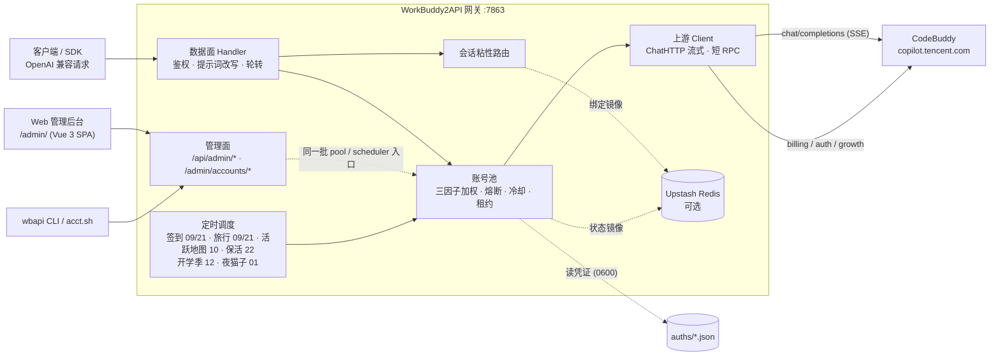

# 核心能力

[← 返回 README](../README.md)

📖 上游功能的完整文档见 [GitHub Wiki](https://github.com/Sliverkiss/workbuddy2api/wiki)。

## 账号池治理

- **OAuth 设备授权登录** — `login.sh` 一条命令完成：取授权 URL → 浏览器登录 → token 轮询 → 凭证落盘 → 重启加载，全程无 PKCE（state 由服务端签发），重复执行即可连续添加多账号
- **三因子加权随机选号** — `credits 比例 ×10 + 快过期积分占比 ×8 + 闲置补偿` 三项加权（`pool.expiring_soon` 窗口内的积分优先消耗，默认 7 天），按权重降序取 **Top-5 候选短名单**，再在短名单内加权抽签（等权重候选先随机打乱防惊群、LRU 兜底覆盖全部候选），兼顾积分多、快过期积分先用掉、闲置久的账号；失败账号由熔断 / 冷却 / 连败降权状态机处置（不进权重公式）
- **防惊群** — 跳过 100ms 内刚被选中的账号，多账号同时待命时不打爆同一台
- **在途租约** — 单账号最大在途请求数（`pool.max_in_flight`）限制并发占用，占满的号不参与选号，避免单号过载
- **账本择优** — 每次成功请求按 `usage.credit` 折算每千 token 单价记入 `(账号, 模型)` 账本，免费 / 便宜的账号优先；观测按 EMA 平滑、6 小时未更新即失效（陈旧价格不复活），成本随上游活动实时变化；账本随池状态落盘 `state.json`，重启不丢学费；`/status` 透出 `model_costs` 台账（模型 / 单价 / 末次观测 / 样本数）
- **成本分层条件探索** — costTier 硬过滤（免费 > 未知 > 收费）会把全池锁死在唯一的实测免费号上：其余账号永远轮不到、也就永远学不到「它其实也免费」（垄断 + 学习冻结，issue #136）。破解方式是**搭车改道**：tier 0 垄断层存在且 tier 1 有成员时，距上次探索 ≥ `pool.cost_explore_interval`（默认 30m，`"0"` 关停）就把本次选号改道给一个未知号——承接的是完整真实用户请求，**零新增上游请求**（IP 维度零增量，WAF 友好）。成功即毕业（首观测入账，免费回 tier 0 / 收费出局 tier 2，学费只付一次）；失败走既有冷却 / 熔断策略，无探测风暴。探索频率硬性限幅 ≤ 48 次 / 天 / 模型（24h ÷ 30m），与池规模和 QPS 无关；tier 1 枯竭后自动停探。探索节奏按 `(域, 模型)` 独立；`/status` 透出 `cost_explore` 台账（累计事件数 + 各 (域, 模型) 最近探索时刻），与 `model_costs` 行对照即可读出「探索 → 毕业」全链路

## 流量治理

- **分级熔断与冷却** — 429 软冷却（600s 起指数退避、封顶 `soft_rate_max`）、404 固定浅冷却、402 / 余额耗尽硬冷却至次日 04:00、连续失败熔断（`breaker_threshold` 触发后指数退避封顶 6h）
- **模型级限流独立冷却** — 6004（该模型使用量超限）只冷却触发调用的模型，切其他模型立即可用；`/status` 透出 `rate_limited_models` 台账
- **账号临时停用 / 恢复** — 运维可把某个号临时摘出选号池、观察后再放回，不必删凭证（issue #138/#118）。语义是「对话流量摘除」而非「账号冻结」：停用期间签到、token 保活、排程任务照常执行，账号仍在池里、状态照常透出。与系统自动禁用是**两个独立状态位**（`manual_disabled` / `disabled`），各自清除、都清空才回到选号池——避免运维意图被签到解冻等自动复活路径意外解除；停用状态随池状态落盘，重启保留。入口：`/admin/accounts/{uid}/{disable,enable,revive}` 端点 + `cmd/acct` CLI + 面板「账号池」页 + `wbapi acct`（默认关闭，`admin.enabled` 显式开启）
- **清冷却** — 把某个号的软冷却 / 降权状态立刻清掉、拉回选号池（熔断计数与积分不动），用于「手动确认这个号没问题了」。面板「账号池」页与 `wbapi` 可用
- **状态持久化** — 池状态（积分 / 冷却 / 熔断 / 计数）本地原子落盘 `state.json`，可选镜像至 Upstash Redis，重启后择优恢复

## 请求链路

- **流式 + 非流式** — 出站强制 `stream:true`；SSE 帧按 OpenAI 规范白名单重建；非流式由本地聚合为单响应
- **请求体归一化** — 出站前把非标准形态折进标准 OpenAI：AI-SDK v5 / ZCode 的内容块数组（`text` / `reasoning` / `tool-call` / `tool-result` / `image`）、字典形态的 `tools`、`maxOutputTokens` 别名；孤儿 tool 消息降级为 user（上游 11148），`image_url` 字符串兼容为对象形态，`developer` 角色与 `tool_choice` 归一
- **DeepSeek 思维链注入** — 出站请求体注入 `thinking.type=enabled` + 默认档位，`reasoning_content` 多轮回填，`reasoning_effort` 按模型档位自动降级
- **系统提示词三模式**（`prompt.mode`，缺省 `passthrough`） —
  - `passthrough`（缺省）：透传客户端原始 system，遇内容拦截自动降级中性提示词重试
  - `custom`：网关用自有提示词**替换**客户端 system/developer（从源头消除模板句误报；不参与降级）
  - `append`：**两者并用**——开头连续 system/developer 块之后插入网关自有提示词，客户端项目规范/工具约定与网关人格共存（issue #129）；降级期与拦截首遇重试时退化为 `custom` 语义（换中性提示词，原文 system 移除）
  - `prompt.file`（custom/append 生效）指向自定义提示词文件，空 = 内置默认
- **会话头族注入** — 出站携带官方客户端会话头族（`X-Conversation-Request-ID` 聚合主键 · `X-Conversation-ID` 透传 · B3 链路），轮转 / 重试 / 路径回退复用同键，后台按对话轮聚合不再碎片化（issue #35）
- **指纹脱敏** — 出站请求体黑名单指纹字段清洗（可开关），与提示词体系两层叠加

## 选号语义

选号 = 会话粘性（命中即定）→ 成本分层（硬过滤）→ 加权随机（软均衡）三层串联，各层语义：

- **成本分层** — 账本把每个 `(账号, 模型)` 归入三档：**tier 0**（实测免费，单价 ≤ 0）、**tier 1**（无观测）、**tier 2**（实测收费）。同一次选号在**存活的最便宜档内**选：有 tier 0 就只在 tier 0 里挑，全池无免费观测才落到 tier 1，再不行才是 tier 2——即「贵号永远只作兜底」。tier 1 的号**不会被跳过**：新账号 / 新模型没跑过就没有观测，直接淘汰会把新号饿死。观测随 `usage.credit` 实时更新且 6 小时过期，所以限免窗口（如夜间免费）一结束，账号回到 tier 1 / tier 2，选号自动跟随——无需重启，日志会打 `free tier ended` 提示价格切换
- **会话粘性** — 同一对话固定走同一账号（多轮上下文不跳号、上游 prompt cache 不碎）。粘性键按此优先级取：**conversation 维度四键**（`metadata.conversation_id` / `metadata.conversationId` / `conversation_id` / `conversationId` 任一）→ **`prompt_cache_key`**（pi-ai 系客户端把会话 ID 放在这个 OpenAI 前缀缓存字段里）→ **首条 user 消息文本的 sha256 兜底**（OpenAI 兼容协议无会话 ID 字段，dsh / Codex 等客户端四键全缺，此前粘性恒不命中、逐请求换号；现由首条 user 消息派生会话级稳定键——会话内历史追加不影响该键，开新会话自然换键）。`user_id` **不是**粘性键——它会把一个用户的所有并行对话钉到同一个号上（粒度远粗于上游对话级缓存边界），发 `user_id` 的客户端回落加权轮换（**该回落同样适用于首条 user 消息兜底**：请求体带 `metadata.user_id` 或顶层 `user_id` 时不派生兜底键）。绑定 30 分钟滚动续期，空闲即过期释放
- **负载分布** — 粘性与分层都未限定时，三因子加权随机（`credits ×10 + 快过期积分 ×8 + 闲置补偿`）把流量摊开：高余额号多扛、快过期积分的号先用、闲置号补位；防惊群跳过 100ms 内刚选中的号。权重是**概率倾斜**而非硬排序（Top-5 短名单 + 名单内抽签），不会让单一账号垄断流量

## 定时积分任务

- **签到**（09 / 21 点）— 每日签到 + 余额查询，余额恢复自动解冻冷却账号
- **活跃地图**（10 点）— 对话事件连发上报点亮活跃地图与连登天数、解锁领养前置，补签卡保连登、连登档位兑换 + 抽奖、礼包/补偿领取，回读 streak 自检
- **猫猫旅行**（09 / 21 点）— 独立排程：领养 / 派出 / 领奖闭环推进
- **token 保活**（22 点）— 全账号刷新 token，session 失效连续 3 次才禁用
- **开学季任务**（12 点）— 任务点亮 + claim + 自动抽空抽奖余额，活动下线时自动跳过
- **夜猫子任务**（01 点）— 夜猫窗口（23:00–08:00 CST）内补一次 black_cat 任务

六类任务独立排程、独立开关（`schedule.*_enabled`），互不影响；都能从面板「总览」页或 `wbapi task` 手动触发一次。

## 双域适配

- 同时适配**国内版（CN，`copilot.tencent.com` / `www.codebuddy.cn`）与国际版（Global，`www.workbuddy.ai`）**账号
- 共享同一账号池，由账号 `realm` 或请求模型名前缀（`cn:` / `global:`）决定路由；`global.enabled` 可一键锁死纯 CN 部署
- 国际版支持注册激活、地区完善、一次性 trial 加油包领取（`./trial.sh`）

## 辅助工具

- **Web 管理后台** — 内置面板，浏览器里看账号池、密钥、请求日志、模型与生效配置，做停用 / 恢复 / 复活 / 清冷却、密钥增删、任务手动触发，还能直接在面板里试模型（见 [管理后台与 CLI](admin.md)）
- **`wbapi` 运维 CLI** — 一个脚本覆盖状态 / 自检 / 账号 / 配额 / 密钥 / 模型 / 任务 / 日志 / 服务启停（见 [管理后台与 CLI](admin.md)）
- 积分日报：`./credit.sh`（美化 / `-json`，realm 感知双域）
- 手动签到：`./signin.sh`（批量、幂等不重复计）
- 账号停用 / 恢复：`./acct.sh list | disable <uid> [原因] | enable <uid> | revive <uid>`（需 `admin.enabled`，走网关管理端点）
- 领养联动 / 任务查询：`scripts/task_runner.py`（成长任务一体机，默认 dry-run）
- 个性化提示词：`prompt.file` 指向自定义提示词文件即整体替换内置默认（`custom`/`append` 模式生效）

## 架构总览

上游请求在出站前经历统一的改写管线（`internal/upstream/payload.go`）：请求体归一化（含 ZCode / AI-SDK 形态）、强制 `stream:true`、`developer` 角色归一、`tool_choice` 归一、`image_url` 字符串兼容为 OpenAI 对象形态、DeepSeek 思维链注入、`reasoning_effort` 档位降级、`reasoning_content` 回填、指纹脱敏。

面板里的「模型对话」不是旁路：它把请求交给同一个数据面 handler，选号、粘性、冷却换号、请求日志、统计全部照走，等于一条随手的链路自检。
